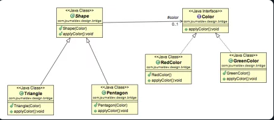

### Decouple an abstraction from its implementation so that the two can vary independently.

## Examples and explanation:

- Consider you have a weapon with different enchantments, and you are supposed to allow mixing different weapons with different enchantments. What would you do? Create multiple copies of each of the weapons for each of the enchantments or would you just create separate enchantment and set it for the weapon as needed? Bridge pattern allows you to do the second.
- Bridge pattern is about preferring composition over inheritance. Implementation details are pushed from a hierarchy to another object with a separate hierarchy.
- The bridge pattern is a design pattern used in software engineering that is meant to "decouple an abstraction from its implementation so that the two can vary independently"

## Cases when Bridge could be used:

- You want to avoid a permanent binding between an abstraction and its implementation. This might be the case, for example, when the implementation must be selected or switched at run-time.
- Both the abstractions and their implementations should be extensible by subclassing. In this case, the Bridge pattern lets you combine the different abstractions and implementations and extend them independently.
- Changes in the implementation of an abstraction should have no impact on clients; that is, their code should not have to be recompiled.
- You have a proliferation of classes. Such a class hierarchy indicates the need for splitting an object into two parts. Rumbaugh uses the term "nested generalizations" to refer to such class hierarchies.
- You want to share an implementation among multiple objects (perhaps using reference counting), and this fact should be hidden from the client. A simple example is Coplien's String class, in which multiple objects can share the same string representation.
