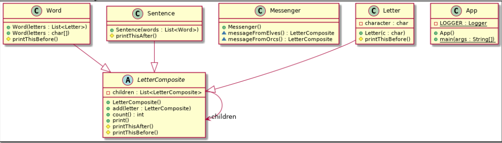

### Compose objects into tree structures to represent part-whole hierarchies. Composite lets clients treat individual objects and compositions of objects uniformly.

## Examples and explanation:

- Every sentence is composed of words which are in turn composed of characters. Each of these objects is printable and they can have something printed before or after them like sentence always ends with full stop and word always has space before it.
- Composite pattern lets clients treat the individual objects in a uniform manner.
- In software engineering, the composite pattern is a partitioning design pattern. The composite pattern describes that a group of objects is to be treated in the same way as a single instance of an object. The intent of a composite is to "compose" objects into tree structures to represent part-whole hierarchies. Implementing the composite pattern lets clients treat individual objects and compositions uniformly.

## Cases when Composite could be used:

- You want to represent part-whole hierarchies of objects.
- You want clients to be able to ignore the difference between compositions of objects and individual objects. Clients will treat all objects in the composite structure uniformly.

### Examples in java:

- java.awt.Container and java.awt.Component
- Apache Wicket component tree, see Component and MarkupContainer

